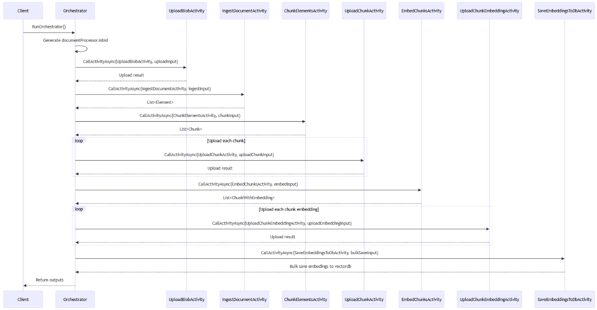
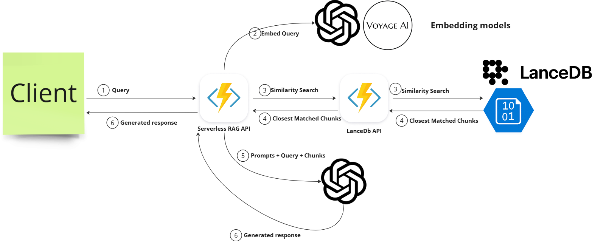

# Serverless RAG
My attempt at building a fully serverless RAG pipeline

# What It Does
The code provides an ingestion pipeline that accepts multiple types of documents. 

It also provides a few chunking strategies to choose from and 2 different embedding models.

After ingesting the documents, you can use the console application to chat with the documents that were uploaded.

# Built with 
C# Azure Durable Functions
Unstructured
OpenAI and Voyage for Embeddings
LanceDb stored in Azure Blob Storage
Azure Functions Python (API layer to LanceDb)

# Document Ingestion Sequence Diagram (Azure Durable Function)

# RAG Diagram

# How to use it
You must have everything set up and run both the DocumentProcessing project as well as the ServerlessLanceDb-Python Azure Function project

